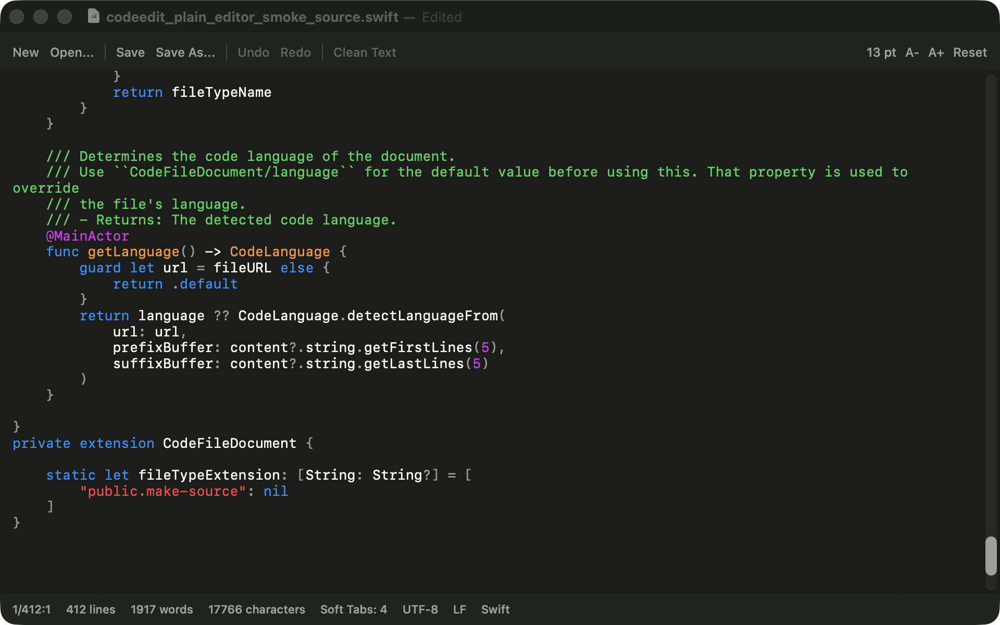

# SwiftlyCodeEdit

A fast native code editor for macOS. It is a lightweight Swift/SwiftUI-first text and code editor for Apple Silicon Macs running Tahoe or newer, with a SwiftPM-first build path.

## Documentation

- [docs/REPO_STYLE.md](docs/REPO_STYLE.md): repo-wide workflow, file organization, and maintenance rules.
- [docs/PYTHON_STYLE.md](docs/PYTHON_STYLE.md): Python rules for scripts and automation.
- [docs/PYTEST_STYLE.md](docs/PYTEST_STYLE.md): pytest structure, fixture policy, and brittle-test avoidance.
- [docs/CLAUDE_HOOK_USAGE_GUIDE.md](docs/CLAUDE_HOOK_USAGE_GUIDE.md): allowed command patterns and file-search guidance for agents.
- [docs/MARKDOWN_STYLE.md](docs/MARKDOWN_STYLE.md): Markdown conventions for this repo.
- [docs/COLOR_CONTRAST_ACCESSIBILITY.md](docs/COLOR_CONTRAST_ACCESSIBILITY.md): color contrast and accessibility guidance.
- [docs/E2E_TESTS.md](docs/E2E_TESTS.md): end-to-end test layout and usage.
- [docs/AUTHORS.md](docs/AUTHORS.md): project authors and background.

## Quick start

1. Run `./build_debug.sh` to build and launch the debug app with SwiftPM.
2. Run `./build_release.sh` to make a release build, with optional install to `/Applications` via `INSTALL_TO_APPLICATIONS=1`.
3. Open `CodeEdit.xcodeproj` in Xcode if you want to run or debug interactively.

## Screenshots

<!-- screenshots:begin (managed by screenshot-docs) -->

<!-- screenshots:end -->

## Notes

- This fork does not currently ship separate `docs/INSTALL.md`, `docs/USAGE.md`, or `docs/TROUBLESHOOTING.md` files.
- The upstream project also includes community, contribution, and sponsorship content; keep that detail in the repo docs rather than expanding this front page.
